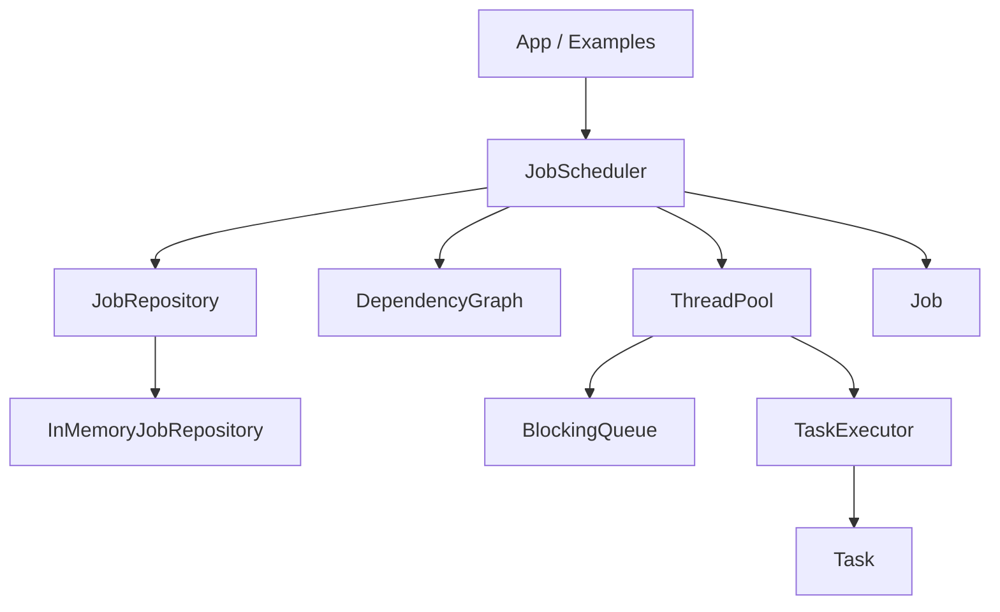

# Distributed Job Scheduler

A C++20 job scheduler prototype focused on local task execution, dependency ordering, failure handling, and clean layering. The current implementation is not distributed yet; it provides the core building blocks for a future distributed scheduler.

## Features Implemented

- Core `Job` and `Task` models with IDs, names, statuses, retry counters, cooperative timeout metadata, and task actions.
- In-memory `JobRepository` implementation.
- Thread-safe `BlockingQueue<T>`.
- Fixed-size `ThreadPool`.
- `TaskExecutor` that records success, error message, execution duration, and reports timeout failures after tasks return.
- `DependencyGraph` for dependency readiness and cycle detection.
- `JobScheduler` that runs ready tasks, unlocks dependents, waits for terminal job state, and marks failed jobs.
- Example programs for independent tasks, dependent tasks, and failure handling.
- CTest-based unit tests using standard C++ assertions.

## Architecture



Layers:

- `core`: domain types such as `Job`, `Task`, `JobStatus`, `TaskStatus`, `JobId`, and `TaskId`.
- `concurrency`: `BlockingQueue<T>` and `ThreadPool`.
- `execution`: `TaskExecutor` and `ExecutionResult`.
- `scheduling`: `DependencyGraph` and `JobScheduler`.
- `storage`: `JobRepository` interface and `InMemoryJobRepository`.

More detail is available in [docs/architecture.md](docs/architecture.md).

## Build

```bash
./scripts/build.sh
```

Equivalent manual commands:

```bash
cmake -S . -B build
cmake --build build
```

## Test

```bash
./scripts/test.sh
```

This builds the project and runs all CTest tests.

## Examples

Run the app and all examples:

```bash
./scripts/run_demo.sh
```

Run individual examples after building:

```bash
./build/example_simple_job
./build/example_dependent_tasks
./build/example_failure_handling
```

## Benchmarks

Run the simple scheduler benchmark:

```bash
python3 benchmarks/benchmark_scheduler.py
```

The benchmark builds `scheduler_app`, runs several local scheduling scenarios with worker counts `1`, `2`, `4`, and `8`, and writes results to:

```text
benchmarks/results.csv
```

Current scenarios:

- `independent_100`: 100 independent tasks.
- `independent_1000`: 1000 independent tasks.
- `chain_100`: 100 tasks where each task depends on the previous task.
- `diamond_batch`: one root task, a parallel batch, and one final fan-in task.

Collected columns include scenario, worker count, task count, total completion time in milliseconds, and tasks per second.

## Current Limitations

- Execution is local only; there are no worker nodes, RPC, networking, or cluster membership.
- Storage is in-memory only and is lost when the process exits.
- Failed tasks fail the whole job after configured retries are exhausted.
- Timeout support is cooperative: the scheduler does not forcibly stop a running thread; timeout is detected after the task returns.
- Benchmarks use no-op tasks, so they measure local scheduler overhead rather than real workload execution.
- No task cancellation, hard timeout enforcement, priority scheduling, or persistence.
- Tests use simple assertion-based executables rather than a full test framework.

## Future Distributed Design

The current layers are intended to evolve toward a distributed scheduler:

- A durable repository can replace `InMemoryJobRepository`.
- The execution layer can dispatch tasks to remote workers instead of local threads.
- Worker heartbeats and leases can detect failed nodes.
- Scheduling can add retries, priorities, resource constraints, and backpressure.
- Distributed coordination can track task ownership, completion, and recovery across nodes.
